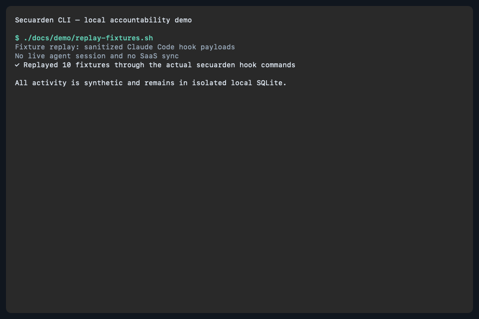

# The governance flight recorder for AI-written code

Git records what code changed. Secuarden records what Claude Code actually did at hook time—files read and written, commands, MCP calls, sensitive-path access, and the active developer identity—so developers, security teams, and platform engineers can investigate and govern AI-assisted work using captured evidence.

- **Authoritative hook-time capture** — records Claude Code actions as they occur, preserving operational detail that Git history does not contain.
- **Local-first by default** — without an API key, redacted events remain in `~/.secuarden/secuarden.db`; no SaaS sync is enabled.
- **Investigation-ready evidence** — inspect capture health, raw events, individual sessions, and local accountability reports from the CLI.
- **Optional SaaS feedback** — API-key-enabled sync sends redacted summaries for branch-level risk feedback.
- **Shared accountability** — gives developers, security teams, and platform engineers a common evidence record.

> This demo uses the actual Secuarden binary to replay sanitized Claude Code hook fixtures in an isolated temporary HOME. It is not a live agent session and makes no SaaS call.



```text
$ secuarden init
✓ Claude Code detected
✓ Local-only mode (pass --api-key to enable SaaS sync)
✓ Hooks installed (PreToolUse, PostToolUse, SessionStart, SessionEnd)
✓ Database created at ~/.secuarden/secuarden.db

$ secuarden status
Capture: Active · Claude Code
Database: ~/.secuarden/secuarden.db · 76 KB
Sync: Local only

# Optional: enable SaaS sync and branch-level risk feedback
$ secuarden init --api-key sec_xxxx
✓ SaaS sync enabled — session feedback will appear in terminal

# After a Claude Code session, when synced evidence requires review:
── Secuarden ──────────────────────────────────────
⚑ REVIEW REQUIRED — 'feat/auth-refactor' (2 session(s), high risk).
  Triggered: AI-authored authentication changes. Assign AppSec reviewer.
───────────────────────────────────────────────────
```

## Quickstart

### Local-only (no account required)

Captures all agent activity to local SQLite. Nothing leaves your machine.

```bash
# Install
curl -fsSL https://install.secuarden.ai | sh
# or: brew install secuarden/tap/secuarden

# Set up
secuarden init

# Use Claude Code normally — events are captured automatically
claude "refactor the auth module"

# See what was captured
secuarden status

# Inspect, investigate, and export local activity
secuarden events --last 20
secuarden session <session-id>
secuarden report --since 24h --md
```

### With SaaS sync (recommended for teams)

Enables the AI Change Set evaluator and delivers risk feedback to your terminal after every session.

```bash
# Install
curl -fsSL https://install.secuarden.ai | sh

# Set up with your Secuarden API key
secuarden init --api-key sec_xxxx

# Use Claude Code normally across one or more sessions on a branch
claude "implement the payment webhook handler"

# When the session ends you'll see:
# ── Secuarden ──────────────────────────────────────
# ⚑ REVIEW REQUIRED — 'feat/payments' (1 session(s), high risk).
#   Triggered: AI-authored payment/billing changes. Attach test evidence.
# ───────────────────────────────────────────────────
```

Get an API key at [secuarden.ai](https://secuarden.ai). Your repo must be connected in the Secuarden dashboard for change set history to persist across sessions.

### Switching modes

```bash
# Enable sync on an existing install
secuarden init --api-key sec_xxxx

# Disable sync (revert to local-only)
secuarden init

# Use a self-hosted or staging instance
secuarden init --api-key sec_xxxx --api-url https://secuarden.example.com
```

### Using the IDE extension (VS Code / JetBrains)

When you run Claude Code through the IDE extension rather than the terminal, hook output isn't shown in a visible terminal. The session is still captured to local SQLite and — if sync is enabled — the changeset is still evaluated. The feedback is written to `~/.secuarden/last-feedback.json` after every session.

To inspect local capture health and recent activity, open any terminal and run:

```bash
secuarden status
```

```
Secuarden Capture Agent v0.1.0

Capture: Active · Claude Code
Database: ~/.secuarden/secuarden.db · 284 KB
Sync: Enabled · https://app.secuarden.ai
Developer: alice <alice@company.com>

Today
  2 sessions · 43 actions · 9 files read · 2 files changed
  8 commands · 1 MCP call · 1 sensitive access

Needs attention
  ⚠ Sensitive access   .env.local
  ⚠ Failed command     npm test · exit 1

Recent sessions
  10:45  auth-service         27 actions · 2 files changed · 2 warnings
  09:18  auth-service         16 actions · no changes · clean

Run `secuarden events` for the raw event log.
Run `secuarden report` for the full accountability report.
```

## Local activity commands

The CLI uses progressive disclosure so capture health, raw evidence, investigation,
and reporting remain separate:

- `secuarden status` — capture health, today's aggregate activity, evidence-backed attention findings, and recent sessions.
- `secuarden events` — chronological raw capture events. Combine `--last`, `--action`, `--session`, and `--sensitive`; add `--json` for scripts.
- `secuarden session <id>` — files, commands and outcomes, MCP calls, sensitive accesses, and failures for one session; supports `--json`.
- `secuarden report` — a 24-hour accountability report scoped to the current Git repository by default. Use `--repo`, `--all-repos`, `--absolute-paths`, `--limit`, `--md`, or `--json` as needed.

All formats use only already-redacted database fields. Reporting never rereads files
and does not make network calls.

### Status

```
Secuarden Capture Agent v0.1.0
Capture: Active · Claude Code
Database: ~/.secuarden/secuarden.db · 76 KB
Sync: Local only
Developer: gaurabb <gaurabb@example.com>

Today
  3 sessions · 52 actions · 14 files read · 6 files changed
  21 commands · 2 MCP calls · 1 sensitive access

Needs attention
  ⚠ Sensitive access   .env.local
  ⚠ Failed command     npm test · exit 1

Recent sessions
  18:04  verify-low-demo      23 actions · 4 files changed · 1 warning
  17:51  verify-low-demo      18 actions · 2 files changed · clean
  16:22  main                 11 actions · no changes · clean
```

### Events

```bash
$ secuarden events --last 3
2026-07-19T08:03:00Z  file_read         .env.local [SENSITIVE]
  status: success
2026-07-19T08:04:00Z  command_exec      npm test
  status: error · exit: 1
2026-07-19T08:05:00Z  mcp_tool_use      memory/create_entities
  status: success

$ secuarden events --action command_exec --session a1b2c3 --json
```

### Session

```text
Secuarden Session

Session ID: a1b2c3
Agent: Claude Code
Developer: gaurabb <gaurabb@example.com>
Repository: https://example.com/secuarden/secuarden-cli.git
Branch: main
Started: 2026-07-19T08:00:00Z
Ended: 2026-07-19T08:10:00Z
Duration: 10m0s
Events: 23

Actions
  command_exec         4
  file_read            12
  file_write           5
  session_end          1
  session_start        1

Sensitive accesses
  [SENSITIVE] file_read · .env.local

Failed, blocked, or rejected actions
  Failed command · npm test · exit 1
```

### Report

Reports are repository-scoped by default, so activity from unrelated projects in
the global database is not mixed together. Repository identities normalize common
SSH and HTTPS forms of the same Git remote without making a network request.

```bash
# Current Git repository, terminal lists limited to 10 entries each
secuarden report

# Select by local path, remote, or owner/repository identity
secuarden report --repo ../verifyflow-demo
secuarden report --repo git@github.com:example/verifyflow-demo.git
secuarden report --repo example/verifyflow-demo

# Cross-repository report, grouped by canonical repository identity
secuarden report --all-repos

# Restore full absolute paths or change the terminal list limit
secuarden report --absolute-paths --limit 25
```

Paths inside the selected repository are rendered relative to its verified Git
root. External reads and changes remain separate, and home-directory paths are
abbreviated with `~`. With `--all-repos`, internal paths are prefixed with the
repository name. Existing JSON path fields retain their original stored values;
additive repository/external collections and `repository`, `display_path`, and
`external` metadata describe classification and presentation.

```text
Secuarden accountability report
Repository: example/verifyflow-demo
Period: Last 24 hours · 18 Jul 13:52 – 19 Jul 13:52 AEST

Summary
  1 session · 16 actions
  1 repository file changed · 1 external file changed
  4 commands succeeded · 0 failed
  1 sensitive-path access

Agent activity
  Claude Code · 1 session · 16 actions

Files changed
  verifyflow/api.py

External activity
  Read     ~/Library/Application Support/Code/User/settings.json
  Changed  ~/other-project/generated.py

Sensitive-path access
  [SENSITIVE] 19 Jul 10:52 AEST · .env.example · session a1b2c3
```

Behind the scenes, each event remains a structured record in SQLite:

```json
{
  "schema_version": "1.0.0",
  "id": "a1b2c3d4-...",
  "session_id": "e5f6a7b8-...",
  "sequence": 17,
  "timestamp": "2026-05-28T10:41:14Z",
  "source": "secuarden-cli",
  "agent_name": "claude-code",
  "hook_phase": "post",
  "action_type": "file_read",
  "tool_name": "Read",
  "is_sensitive": true,
  "file_path": ".env.local",
  "content_hash": "sha256:a3f2b8c1...",
  "redacted_fields": ["content"],
  "developer_email": "gaurab@example.com",
  "os_user": "gaurab",
  "raw_event_hash": "sha256:d4e5f6..."
}
```

## Use Cases

### For security & GRC teams
Your engineering team adopted AI coding tools. Your auditor is going to ask about it. secuarden-cli gives you the raw evidence trail — what the agent did, which files it touched, which commands it ran — so you're not scrambling when CC8.1 comes up in your next SOC 2 audit.

### For platform engineering teams
You rolled out Claude Code to 50 engineers. You have no visibility into what the agent is doing across your codebase. secuarden-cli gives you structured, queryable data on agent behavior without slowing anyone down.

### For individual developers
You prompted the agent to "fix the login bug" and it touched 15 files. Which ones? Did it read your `.env`? Did it run anything unexpected? `secuarden status` tells you in 2 seconds.

### For compliance automation
The [Secuarden Event Schema](schema/secuarden-event.schema.json) is designed for downstream ingestion. Pipe events to your SIEM, feed them to compliance tooling, or build your own analysis. The schema is documented, versioned, and stable.

## Comparison

| | secuarden-cli | [Gryph](https://github.com/safedep/gryph) |
|---|---|---|
| **Primary purpose** | Governance evidence trail | Developer debugging & observability |
| **Secret scrubbing** | Two-layer: sensitive file detection + content redaction with named patterns | Content redaction |
| **Developer identity** | Git config + OS user per session | Not captured |
| **Event schema** | Documented JSON schema, versioned, designed for compliance tooling ingest | Internal schema, JSONL export |
| **Redaction transparency** | `[REDACTED:bearer_token]` — you see what was scrubbed | Content replaced silently |
| **Design philosophy** | Focused local capture, evidence investigation, and accountability export | Full-featured: query, filter, diff, stats, session replay |
| **Agent support** | Claude Code (more coming) | Claude Code, Cursor, Windsurf, Gemini CLI, Copilot, OpenCode |
| **Language** | Go | Go |
| **License** | Apache 2.0 | Apache 2.0 |

Gryph is excellent if you want a local developer debugging tool with rich querying. secuarden-cli is built for a different job: producing structured, privacy-safe, identity-tagged evidence that downstream compliance and security tooling can consume.

## Supported Agents

| Agent | Status |
|---|---|
| Claude Code | ✅ Supported |
| Cursor | 🗓️ Planned |
| GitHub Copilot | 🗓️ Planned |
| Windsurf | 🗓️ Planned |
| OpenAI Codex | 🗓️ Planned |

## Roadmap

- [x] Claude Code capture agent
- [x] Sensitive file detection
- [x] Content redaction with named patterns
- [x] Developer identity capture
- [x] Documented event schema (v1.0.0)
- [x] SaaS sync with `--api-key` switch
- [x] AI Change Set — multi-session risk aggregation per branch
- [x] Immediate terminal feedback on session-end
- [x] Progressive local activity commands: `status`, `events`, `session`, and `report`
- [ ] Cursor support
- [ ] Copilot support
- [ ] Gryph event adapter (ingest Gryph JSONL into Secuarden schema)
- [ ] Event export to SIEM (Splunk, Elastic, Datadog)

## Event Schema

The [Secuarden Event Schema](schema/secuarden-event.schema.json) is the contract between capture agents and any downstream consumer. It's a superset of what Gryph captures, extended with:

- `developer_name`, `developer_email`, `os_user`, `machine_id` — identity fields
- `intent_summary` — the developer's prompt/objective
- `redacted_fields` — transparency about what was scrubbed
- `raw_event_hash` — SHA-256 of the raw hook input for integrity verification
- `compliance_hints` — reserved for downstream compliance tooling (never populated by capture agents)
- `source` and `source_version` — multi-source support from day one

The schema is versioned and stable. Breaking changes will get a major version bump.

## How It Works

### Local-only mode

```
┌──────────────────────────────┐
│        Claude Code           │
│  PreToolUse / PostToolUse    │
│  SessionStart / SessionEnd   │
└──────────┬───────────────────┘
           │ stdin (JSON)  async hooks
           ▼
┌──────────────────────────────┐
│     secuarden hook           │
│                              │
│  1. Parse event              │
│  2. Detect sensitive files   │
│  3. Redact secrets           │
│  4. Capture identity         │
│  5. Write to SQLite          │
└──────────┬───────────────────┘
           │
           ▼
  ~/.secuarden/secuarden.db
```

### With SaaS sync (`--api-key`)

The SessionEnd hook runs synchronously so the terminal stays open for feedback. All other hooks remain async and never slow down the session.

```
Claude Code session ends
           │
           ▼
  secuarden hook session-end  (synchronous)
           │
           ├─► Write to local SQLite  (always)
           │
           └─► POST /api/agent-ledger/session-sync
                       │  Bearer: sec_xxxx
                       ▼
              Secuarden SaaS
                       │
                       ├─ Upsert AgentSession
                       ├─ Resolve repo from git remote URL
                       ├─ Merge into AI Change Set
                       │    (union of all sessions on this branch)
                       └─ Evaluate policies → decision + risk level
                                  │
                                  ▼
              ── Secuarden ──────────────────────────────────
              ⚑ REVIEW REQUIRED — 'feat/auth-refactor' …
              ───────────────────────────────────────────────
              (printed to terminal before Claude Code exits)
```

### AI Change Set

Multiple Claude Code sessions working on the same branch are automatically grouped into one **AI Change Set**. Risk is evaluated across the full accumulated set of files — not just the last session.

```
Session 1 (Mon)  →  touches src/auth/session.ts
Session 2 (Tue)  →  touches src/auth/oauth.ts
Session 3 (Wed)  →  touches src/payment/webhook.ts
                              │
                              ▼
              AI Change Set: feat/payment-refactor
              Files touched: 3 auth + 1 payment path
              Decision:      require_evidence  (high risk)
              Sessions:      3
```

This matters because risk accumulates over days. Evaluating only the last session would miss that the branch already touched auth code two days ago.

## Data & Privacy

- **Local by default.** Without `--api-key`, nothing leaves your machine. No network calls, no telemetry, no analytics.
- **Opt-in sync.** When `--api-key` is set, only the session summary (files edited, branch name, event count) is sent to Secuarden. Raw code diffs and command output are never uploaded.
- **Sensitive files** (`.env`, `*.pem`, `.ssh/*`, credentials) — file paths are recorded but content is never stored or uploaded.
- **Content redaction** — API keys, tokens, JWTs, bearer tokens, and credentials are scrubbed from shell commands and output before storage. Redacted content is replaced with `[REDACTED:<pattern_name>]`.
- **Your coding session is not slowed down.** All hooks except SessionEnd run asynchronously. SessionEnd is synchronous only to deliver feedback; it exits in under a second with or without sync enabled.

## Uninstall

```bash
# Remove hooks, keep captured data
secuarden uninstall

# Remove everything including captured data
secuarden uninstall --purge
```

## Contributing

Contributions welcome. The most impactful areas:

1. **New agent support** — adding hooks for Cursor, Copilot, Windsurf. See `internal/agent/claudecode.go` for the pattern.
2. **Redaction patterns** — new vendor-specific secret patterns in `internal/privacy/redact.go`.
3. **Test fixtures** — realistic hook JSON samples in `test/fixtures/`.

```bash
# Build
make build

# Test
make test

# Install locally
make install
```

Please open an issue before starting significant work so we can align on approach.

## License

Apache 2.0 — see [LICENSE](LICENSE).

---

Built by [Secuarden](https://secuarden.ai). The capture agent is open source. The compliance intelligence platform is coming.
